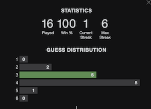

# My Wordle Solver

    [] (https://www.kaggle.com/vladistan1/my-wordle-solver)

  

Looks like the `Wordle` game has taken the world by the storm.  Here is my contribution to this madness.  This interactive notebook provides the solver that comes up with the next best choice to use as a guess word.

Most of the time this solver takes between 3 to 4 attempts to solve the puzzle. The performance for the last two weeks is  on the stats badge below. Note that this statistics include older versions of the solver that had some bugs that affected the accuracy.

### How does it work?

Unlike other solvers on the internet this one uses both the likelyhood of the word to contain a particular letter and the likelyhood of each letter being at a particular position.  Unlike *hangman*, in the *Wordle* puzzle we need to guess both a letter and it's position.

A lot of english words start with the letters 'm' or 's' and end with 's' or 'e'. 

After the solver produces a guess word the user has to enter it into the today's game and provide the solver with the feedback.  The solver uses the feedback to cull the list of potential words and use the relative frequencies of each letter in each position of the culled list.

Eventually the list of alternatives becomes very small. When the list size is less than 3 words relative frequencies don't help anymore and everything boils down to the random choice.  Luckly the solver has 30% chance to guess the word correctly.

